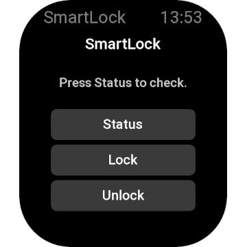
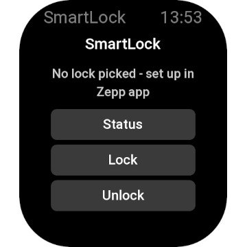
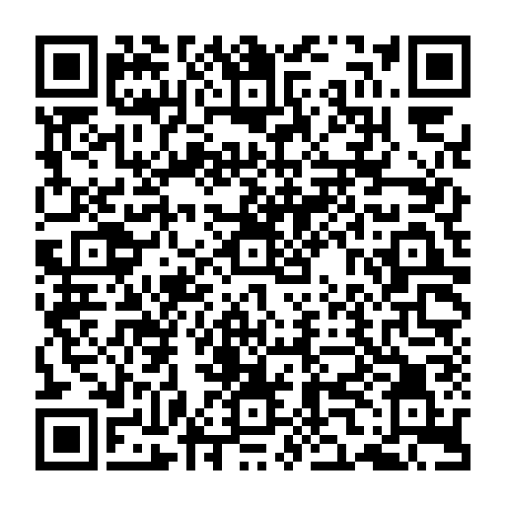

# SmartLock for Zepp OS

Lock, unlock and check the status of your Nuki Smart Lock right from your wrist. A Zepp OS Mini App for the **Amazfit Bip Max** (device code `PikeW`, square display).

<p align="center">
  
  
  
</p>

Full architecture concept: [`nuki-zeppos-konzept.md`](nuki-zeppos-konzept.md) (German).

## Status: M1 "walking skeleton" (18.08.2026)

The full round trip works end to end on a real device: watch → Side Service → Nuki Web API → response shown on the watch, including a double-tap confirmation before Lock/Unlock actually fire. Submitted to the Zepp OS app store as **SmartLock** (App ID 1123926, v1.0.2), currently awaiting review.

Not yet verified against a real Nuki account with a lock actually online - `trimSmartlock()`'s field names in `app-side/index.js` are taken from the Nuki API docs, not confirmed against a live response yet.

**Next step:** enter a Nuki Web API token (scopes `smartlock.action` + `smartlock.readOnly` only, not the full-access token) and the smartlock ID once the app is installed through the official store listing - QR/Developer-Mode sideloaded installs don't get a Settings page from the Zepp app (see "Lessons learned" below).

## Project structure

```
app.json                 # Target "PikeW" (Amazfit Bip Max), apiLevel 3.0
app.js                   # MessageBuilder connection watch <-> Side Service
app-side/
  index.js               # Message dispatcher (GET_STATUS/ACTION/LIST_LOCKS)
  nuki-web-backend.js     # Variant A: direct https://api.nuki.io client
page/index.js             # Main screen: status text + Status/Lock/Unlock buttons,
                           # double-tap-to-confirm on Lock/Unlock
setting/index.js          # Token + smartlock ID (Zepp app Settings page)
shared/protocol.js         # Message types + error codes, imported by both sides
shared/message*.js, event.js, defer.js, ...  # Zepp OS messaging scaffolding
                           # (taken from the official "Fetch Api" template)
utils/config/              # Device width/height, color constants
assets/logo.svg            # Source for the app icon (circular, no trademarked colors)
screenshots/                # Real-device screenshots used in this README / the store listing
test-builds/pikew.zip       # Latest sideload-test package (hosted for QR install, see below)
```

## Not implemented yet (upcoming milestones)

- **M2** - proper state machine (SENDING/PENDING/SUCCESS/ERROR), status polling after an action, haptics, buttons disabled while an action is in flight.
- **M3** - "Load locks" button in Settings (`LIST_LOCKS`-driven picker) instead of typing the smartlock ID by hand.
- **M4** - icons, unlatch confirmation dialog, i18n.
- **M5** - Variant B (own proxy instead of talking to the Nuki Web API directly).

## Building

```
npm install -g @zeppos/zeus-cli   # if not already installed globally
zeus build
```

`zeus preview`/`zeus dev` need a Zepp account connected via `zeus login` plus a simulator or a real device bridge - not set up in this environment (headless VM, no browser for the login callback).

## Sideload-testing via QR code

`zeus login` needs a real browser for its login callback, which a headless environment doesn't have. As a workaround, this repo hosts the latest test build's inner `.zpk` (renamed `.zip`) at `test-builds/pikew.zip`, served publicly via jsDelivr and turned into a `zpkd1://` deep link that the Zepp app's Developer Mode QR scanner accepts directly - no `zeus login`/bridge needed on the build machine.

Current test build - scan with the Zepp app (Profile → Developer Mode → QR scanner):



```
zpkd1://cdn.jsdelivr.net/gh/UniqueDroid/Nuki-Smartlock-ZeppOS@<commit-sha>/test-builds/pikew.zip
```

Pin the URL to a commit SHA, not `@main` - jsDelivr's branch-alias caching lagged behind pushes during testing, while SHA-pinned URLs resolved reliably. Note: since `test-builds/qr.png` and this README are themselves committed to the repo, the SHA baked into the QR image necessarily points at the commit *before* the one that added/updated the image (adding the image is what creates the newer commit) - harmless, since the app package it points to didn't change in between, but don't be surprised the SHA isn't literally `HEAD`.

Important: the `zpkd1://` link must point at the **inner `.zpk`** file (itself a zip of `device.zip` + `app-side.zip`), not the outer `.zab` that `zeus build` produces - the `.zab` is just a container around one `.zpk` per target device, and the Zepp app can't parse the container directly ("Parse mini program package failed").

**Updating the QR code after a new build:** extract the fresh `.zpk` into `test-builds/pikew.zip` (see the loop in project memory / prior commits for the exact `zipfile` snippet), commit+push, take the new commit's SHA, regenerate `test-builds/qr.png` from `zpkd1://cdn.jsdelivr.net/gh/UniqueDroid/Nuki-Smartlock-ZeppOS@<sha>/test-builds/pikew.zip` (e.g. Python's `qrcode` package), and commit that too.

## Lessons learned

- **App Store submission rejects trademarked names.** The first submission (as "ZeppNuki") was rejected for using the protected "Nuki" and "Zepp" names in the app name, plus an icon that too closely echoed Nuki's brand colors. Renamed to "SmartLock" everywhere - including `app.json`'s `i18n.en-US.appName`, which is a **separate field** from the top-level `app.appName` and easy to miss in a find-and-replace (different indentation/no trailing comma made a naive `replace_all` skip it once).
- **Store icons must be a true circle**, 248×248px with a 4px transparent margin, no solid-black background - not just "rounded corners". See `docs.zepp.com/docs/designs/visual/icons/`.
- **QR/Developer-Mode sideloaded apps don't get a Settings page** anywhere in the Zepp app UI - confirmed by testing against a different, properly *published* sideloaded app that still didn't show up under the phone's "More" section (where store-installed apps like Intervals.icu get a settings arrow). Settings access seems tied to a proper store install, not just to publish status.
- **`app.json`'s `permissions` list matters even for basics** - missing `data:os.device.info` silently crashed the whole app before any page could even render (blank screen, no error), since `getDeviceInfo()` is called at module-import time.
- **The Side Service's error responses and success responses use sibling fields**, `{error}` vs `{result}` - never nested inside each other. A page-side bug that checked `result.error` instead of the top-level `error` swallowed every error message and showed "Unknown (undefined)" instead.
